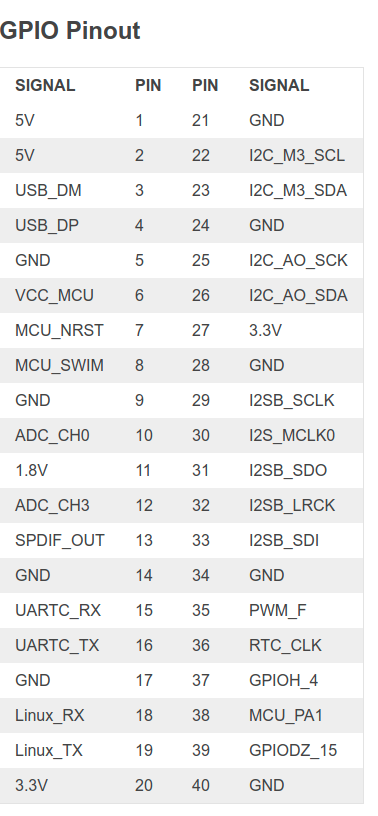

# android_gps_hal_driver

KHADAS VIM3 GPS Porting GUID

    

GPS 폴더를 안드로이드 소스코드의 hardware 폴더로 이동합니다.

    mv android_gps_hal_driver/gps khadas_vim3/hardware/

kvim3.mk 파일 아랫쪽에 다음 내용을 추가합니다.

    path : androidsrc/device/khadas/kvim3/kvim3.mk 

    #GPS
    PRODUCT_PACKAGES += \
        gps.$(PRODUCT_DEVICE) \
        android.hardware.gnss@1.0 \
        android.hardware.gnss@1.0-impl \
        android.hardware.gnss@1.0-service
    
kvim3의 남는 UART포트는 다음과 같습니다.

    gps uart port : /dev/ttyS3
    UARTC_RX	15
    UARTC_TX	16	

핀 설명 문서

https://docs.khadas.com/vim3/

